# 计算机系统结构作业仓库

本仓库对应课程 **计算机系统结构** 的 Git 作业。项目名称按老师要求使用 `arch`。用户名使用学号注册校内 GitLab，并把 `cshao` 加为 **Maintainer**。


| | |
| -: | :- |
|科目|计算机系统结构|
|班级|软件工程4班|
|学号|3124004588|
|姓名|林润鑫|

- 作业 1：[作业1.md](作业1.md)（2026-09-03）
- 作业 2：[作业2.md](作业2.md)（2026-09-10）
- 作业 3：[作业3.md](作业3.md)（2026-09-17）
- 作业 4：[作业4.md](作业4.md)（2026-09-24）


每次作业在根目录保留一个 `作业x.md`。编程相关源码放在 `作业x代码/`，图片放在 `imgs/`，路径一律写相对路径。

## 目录

```
.
│  .gitignore
│  homework_from_cshao.md
│  README.md
│  作业1.md
│  作业2.md
│  作业3.md
│  作业4.md
│
├─from_cshao/          # 老师目录，不在此改评语
├─imgs/                # Markdown 引用的图片
├─scripts/             # 生成 imgs 的辅助脚本（非作业要求）
├─作业1代码/
│      cache_map.c     # 作业 1 自拟示例程序
└─作业4代码/
       sum_array.s     # 作业 4 MIPS 汇编示例程序
```

本地查看：用支持 Markdown 的编辑器打开 `作业x.md`。校内提交：在服务器开放时段（周一、周四下午约 17:00 开启，次日 01:00 关闭）推到 `http://10.21.21.251`。先访问该页面确认服务器是否在线。

`from_cshao/` 由老师写入 `check.md`、`Comments.md` 等文件，不要自行修改。`homework_from_cshao.md` 是布置说明原文。

---


## 作业 1 正文

完整排版与图片见 [作业1.md](作业1.md)。下面保留作业内容，方便 GitLab 首页直接阅读。

### 计算机系统结构在研究什么

计算机系统结构关心的是：指令系统、微结构、存储层次和系统互连如何共同决定一台机器的性能、功耗与可编程性。

### 冯·诺依曼结构

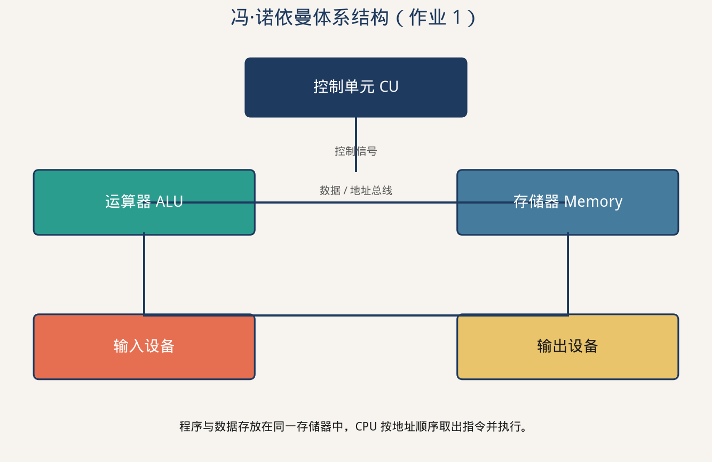

程序与数据共用存储器。现代 CPU 对外仍是这一编程模型，片内 Cache 则常按哈佛结构把指令和数据分开。

### 指令流水线

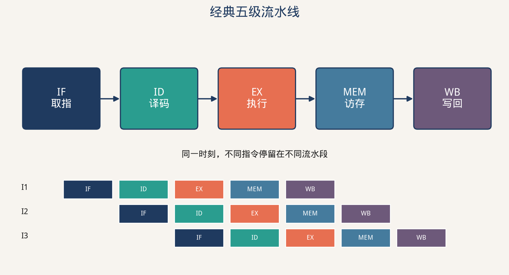

五级为 IF / ID / EX / MEM / WB。数据相关、控制相关、结构相关会插入气泡。

### 存储层次

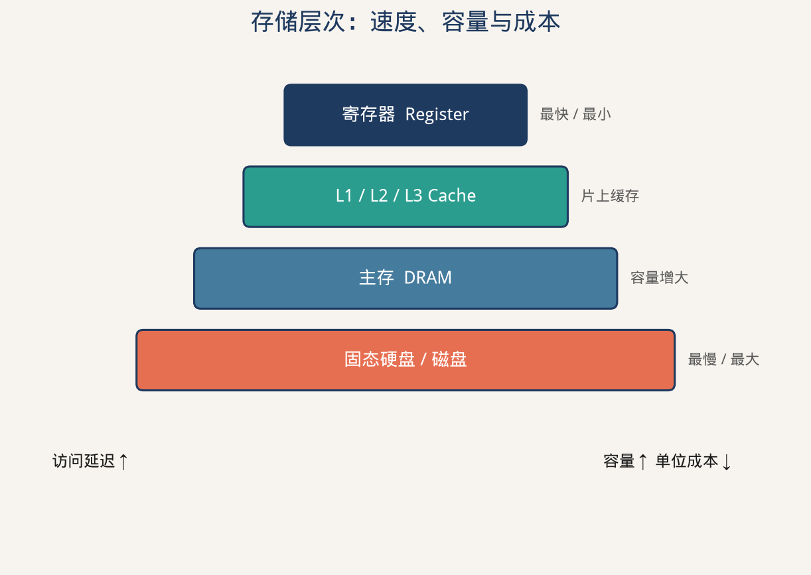

### 自拟代码：直接映射 Cache

源文件：[`作业1代码/cache_map.c`](作业1代码/cache_map.c)

假设 32KB Cache、64B 块、直接映射：offset 6 位，index 9 位，其余为 tag。

```c
#include <stdio.h>
#include <stdint.h>

int main(void) {
    const unsigned cache_bytes = 32 * 1024;
    const unsigned block_bytes = 64;
    const unsigned num_sets = cache_bytes / block_bytes;
    const unsigned offset_bits = 6;
    const unsigned index_bits = 9;
    uint32_t addrs[] = {0x00001234u, 0x00008234u, 0x0010F000u};
    int n = (int)(sizeof(addrs) / sizeof(addrs[0]));
    printf("sets=%u  offset_bits=%u  index_bits=%u\n",
           num_sets, offset_bits, index_bits);
    for (int i = 0; i < n; i++) {
        uint32_t addr = addrs[i];
        unsigned offset = addr & ((1u << offset_bits) - 1u);
        unsigned index = (addr >> offset_bits) & ((1u << index_bits) - 1u);
        unsigned tag = addr >> (offset_bits + index_bits);
        printf("addr=0x%08X  tag=0x%X  index=%u  offset=%u\n",
               addr, tag, index, offset);
    }
    return 0;
}
```

编译运行：

```bash
gcc -O0 -Wall -o cache_map 作业1代码/cache_map.c
./cache_map
```

---


## 作业 2 正文

完整论述、对照表和参考链接见 [作业2.md](作业2.md)。GitLab 首页摘要如下。

### 路线总览

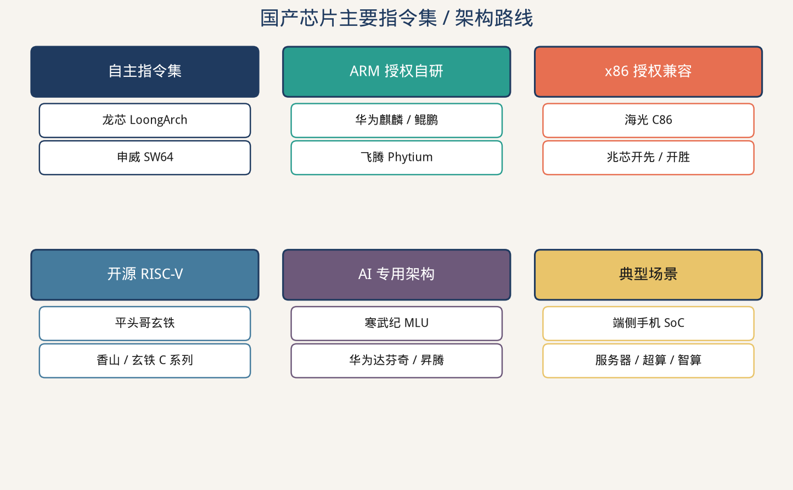

### 华为麒麟 9050 Pro

端侧 SoC。灵犀 CPU 为 `1+2+4+2` 九核并支持超线程；马良 GPU 支持硬件光追；达芬奇 NPU 面向端侧 MoE 大模型；封装使用 LogicFolding 混合键合。

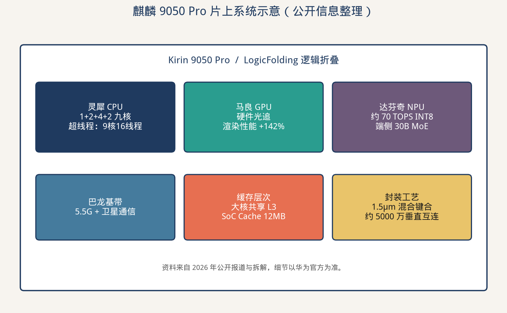

### 龙芯 LoongArch

自主指令集。桌面 3A6000 为 4 核 8 线程 LA664；服务器 3C6000 用龙链扩展到 16/32/64 核。

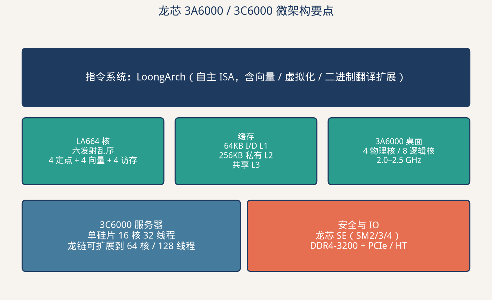

### 寒武纪 MLU

领域专用智能芯片。4 个 MLU Core 加 Memory Core 与共享 SRAM 构成 Cluster。思元 370 采用 MLUarch03 与 7nm Chiplet，双芯卡峰值约 256 TOPS（INT8）。

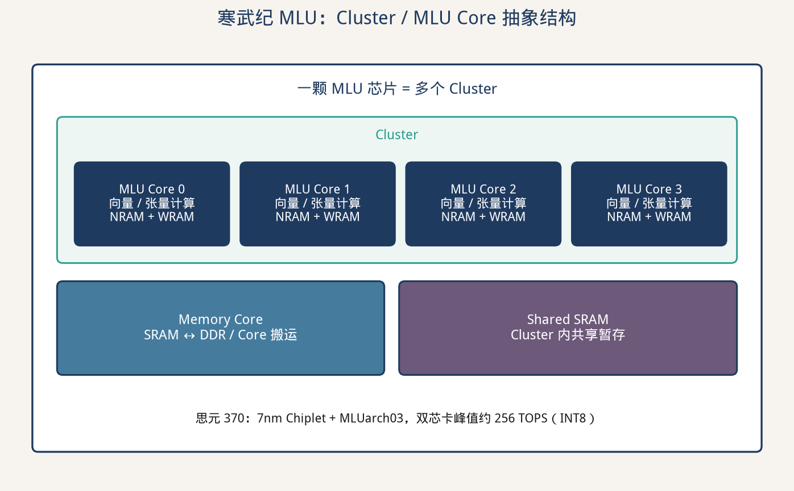

### 对照（节选）


| 产品                     | 企业   | ISA / 架构                  | 课堂关键词                 |
| ---------------------- | ---- | ------------------------- | --------------------- |
| 麒麟 9050 Pro            | 华为海思 | ARM 自研 + 达芬奇              | 异构 SoC、SMT、3D 键合      |
| 龙芯 3A6000 / 3C6000     | 龙芯中科 | LoongArch                 | 自主 ISA、乱序、龙链          |
| 思元 370                 | 寒武纪  | MLUarch03                 | Cluster、NRAM、MLU-Link |
| 鲲鹏 920 / 昇腾 910B       | 华为   | ARMv8.2 / 达芬奇             | 服务器 CPU、训练 NPU        |
| 飞腾 / 海光 / 兆芯 / 申威 / 玄铁 | 各厂商  | ARM / x86 / SW64 / RISC-V | 授权、兼容、超算、开源           |


数字来自厂商手册和 2026 年 9 月前后公开报道，仅供作业使用。

---


## 作业 3 正文

完整论述与推导见 [作业3.md](作业3.md)。GitLab 首页摘要如下。

### 计算机系统结构的分类

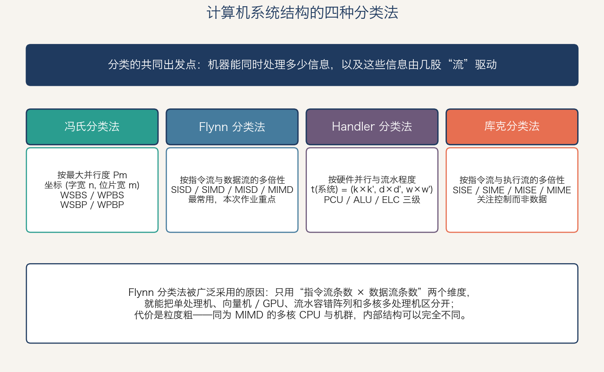

教材给出四种分类法：冯氏（按最大并行度的二维坐标）、Flynn（按指令流与数据流的多倍性）、Handler（按硬件并行与流水程度的三元组）、库克（按指令流与执行流的多倍性）。其中 Flynn 分类法维度最少、覆盖面最广，是最常用的一种。

### Flynn 分类法：SISD / SIMD / MISD / MIMD

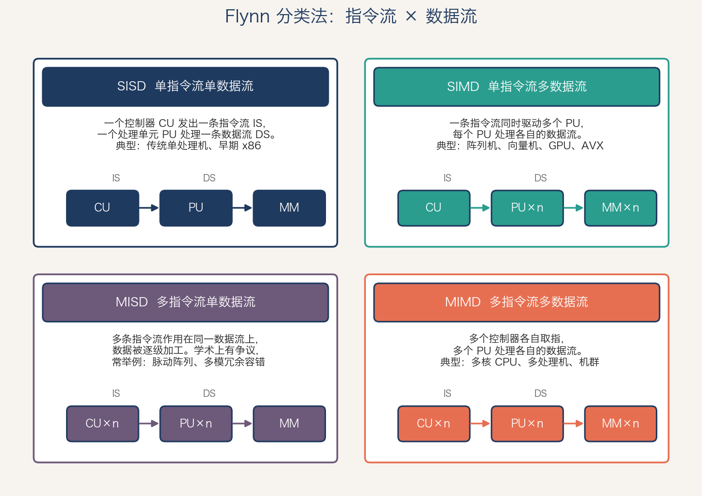

| 类别 | 指令流 | 数据流 | 典型代表 |
| :--- | :-: | :-: | :--- |
| SISD | 1 | 1 | 传统单处理机（带流水线的单处理机仍属此类） |
| SIMD | 1 | n | 阵列机、向量机、GPU、AVX |
| MISD | n | 1 | 脉动阵列、多模冗余容错系统，几乎无商用实例 |
| MIMD | n | n | 多核 CPU、SMP、机群 |

现代系统基本是“MIMD 外壳 + SIMD 内核”的混合结构。

### Amdahl 定律计算题

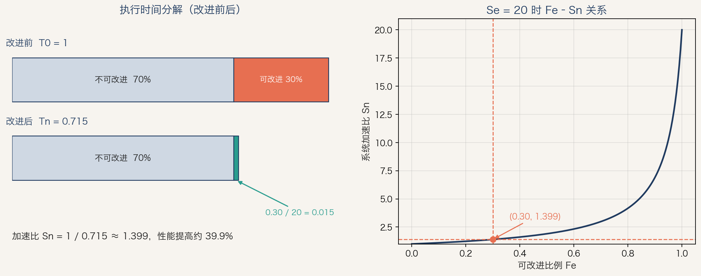

某功能加快 20 倍，该功能占总运行时间的 30%：

```
Fe = 0.3，Se = 20
Sn = 1 / [(1 - 0.3) + 0.3 / 20] = 1 / 0.715 ≈ 1.399
```

系统性能提高约 39.9%。理论上限为 1/(1 − 0.3) ≈ 1.4286，Se = 20 已经取到上限的 97.9%。

---


## 作业 4 正文

完整笔记、MIPS 指令表与习题解答见 [作业4.md](作业4.md)。GitLab 首页摘要如下。

### 第一章剩余内容：定量分析技术

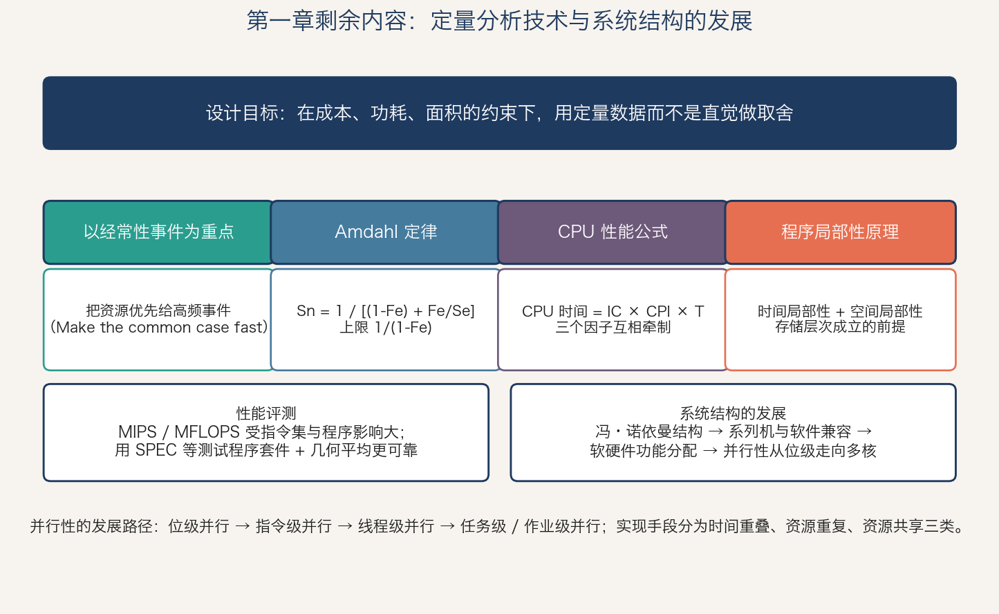

四个定量原理：以经常性事件为重点、Amdahl 定律、CPU 性能公式（CPU 时间 = IC × CPI × T）、程序的局部性原理。并行性从位级、指令级、线程级走向任务级，实现手段分为时间重叠、资源重复、资源共享三类。

### 第二章：指令集结构的分类

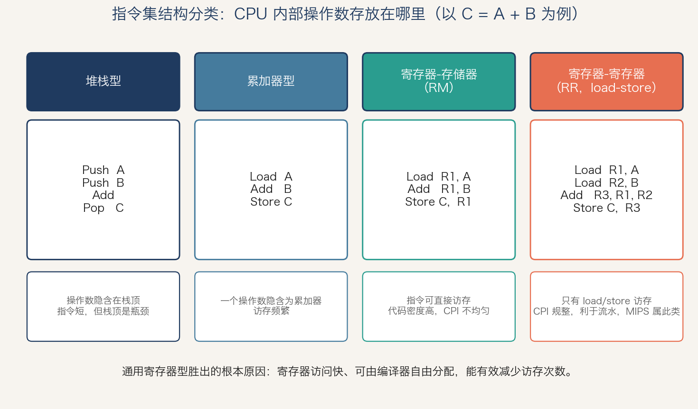

堆栈型、累加器型、寄存器-存储器型（RM）、寄存器-寄存器型（RR）。通用寄存器型胜出的原因是寄存器访问快、可由编译器自由分配，能有效减少访存次数。MIPS 属于 RR（load-store）型。

### MIPS 指令格式

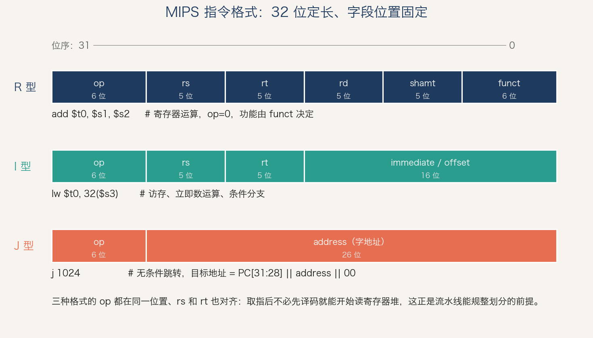

32 位定长，只有 R / I / J 三种格式，且 op、rs、rt 字段位置完全对齐，取指后不必先译码就能开始读寄存器堆。

### 示例程序：数组求和

源文件：[`作业4代码/sum_array.s`](作业4代码/sum_array.s)

```mips
loop:
        beq     $t3, $t1, done      # if (i == n) goto done
        sll     $t4, $t3, 2         # $t4 = i * 4
        add     $t5, $t0, $t4       # $t5 = &arr[i]
        lw      $t6, 0($t5)         # $t6 = arr[i]
        add     $t2, $t2, $t6       # sum += arr[i]
        addi    $t3, $t3, 1         # i++
        j       loop
```

在 MARS 中运行输出 `sum = 31`。

### 第一章课后习题 1.7~1.11

| 习题 | 结论 |
| :--- | :--- |
| 1.7 | Fe = 0.4、Se = 10 ⇒ Sn = 1/0.64 = 1.5625 |
| 1.8 | (1) F₃ ≈ 36%；(2) 不可改进部分占改进后总时间的 0.2/0.245 ≈ 81.6% |
| 1.9 | 各操作加速比 2、1.33、3.33、4；全部改进后 1030/580 ≈ 1.78 |
| 1.10 / 1.11 | 题目原文待补 |
